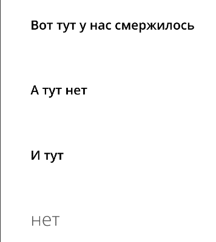
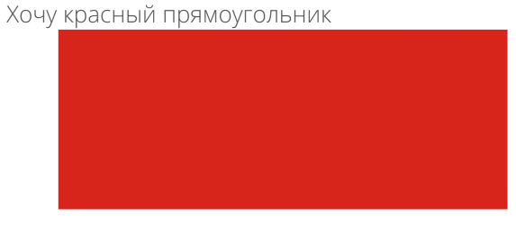
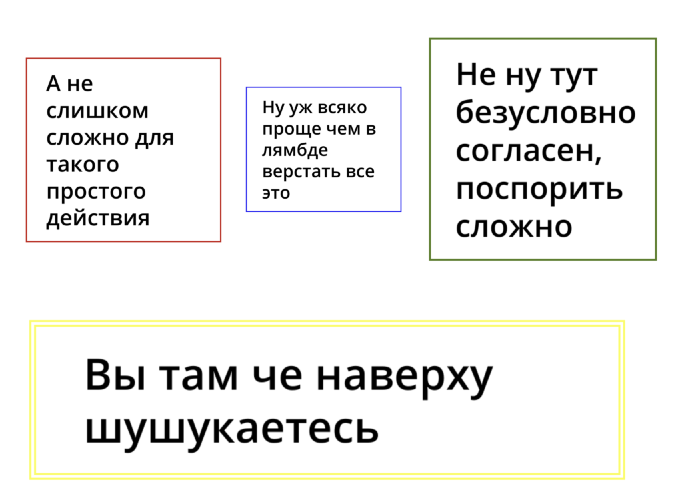

# Markdown интервью: как, зачем и почему

## Зачем?

Верстать ручками одно и то же — грустно. Давайте писать это в Markdown!

Примеры интервью:
[Арсений](/public/interviews/arseniy_seroka_topdevelopers/full.md),
[Саша](/public/interviews/sasha_drozdova/full.md),
[Настя](/public/interviews/nastya_postnikova/full.md)

## Почему Markdown?

Странички с интервью имеют общий, очень простой стиль оформления. Markdown — популярный и легкий в освоении формат
разметки, функциональных элементов которого с лихвой (пока) хватает для описания наших интервью.

Но к сожалению, появляются довольно жесткие правила, не соблюдая которые верстка поедет

## Как?

### Что от вас требуется

Для добавления нового интервью необходимо создать 3 файла:

* `public/interviews/<name of interview>/full.md` — полная версия интервью. О формате этого файла будет ниже;
* `public/interviews/<name of interview>/preview.md` — превью, которое будет отображаться на главной странице и на
  странице со списком всех интервью. Должно содержать 2 абзаца: абзац из **h1** превратится в заголовок, а обычный 
  текст — в короткое описание;
* `public/img/interviews/<name of interview>/preview.png` — картинка, которая будет отображаться вместе с превью.

Помимо этого необходимо добавить `<name of interview>` в файл `src/interviewList.json`. `onIndex` представляет собой
список интервью, которые необходимо отобразить на главной странице, а `all` — те, которые будут на странице со всеми
интервью.

**По прямой ссылке интервью будет доступно, даже если вы не правили `src/interviewList.json`** 

### Как писать full.md
  
Для рендеринга используется [react-markdown](https://github.com/remarkjs/react-markdown). Файл с интервью конвертится в
html-ку, после чего некоторые элементы в нем подменяются.

Необходимо сформировать 2 файла: превью и полная версия. В превью **h1** воспринимается как заголовок, а обычный текст —
как короткое описание. Картинка интервью должна называться `/public/img/interview/<interview_name>/preview.png`

Полная версия анализируется следующим образом:

* **h1** превращается в заголовок интервью
* **h2** — в короткое описание, summary для дальнейшего текста
* **h3** — в вопросы интервьюера
* **Обычный текст** — в ответы интервьюеру
* **h6** — в дату

Не поддержаны:

* **GFM** (при необходимости можно будет включить)
* **h4**, **h5** (будет криво рендериться, зарезервированы под что-то полезное в будущем)

Всякие остальные штуки внутри текста, вроде ссылок, жирного текста и курсива, картинок и так далее должны самым обычным
образом быть встроены в текст

#### Немного фичей!

1. В отличие от обычного текста, текст заголовков нельзя написать в несколько строк, а посему написанные подряд (без
   пустой строки) заголовки **одного** уровня объединяются, что позволяет писать длинные абзацы с описанием и вопросами

```md
### Вот тут у нас
### смержилось


### А тут нет


### И тут
## нет
```

<div align="center">



</div>


2. Когда хочется добавить что-то необычное — отступ там побольше, какую-то полосочку красивую и т.д., можно написать
   сырой html, он прекрасно отобразится

```md
## Хочу красный прямоугольник

<div style="width: 500px; 
            height: 200px; 
            margin-left: 100px; 
            background-color: red">
</div>
```

<div align="center">



</div>


3. Картинки можно выставлять слева направо. Если вам нужна 1 картинка, пишите как попало, если больше, 
   то из-за специфики парсинга:
     * Первая картинка должна быть написана через html тег, который разнесен хотя бы на **2 строки** 
       (тогда парсер создает параграф, который можно нормально перерендерить)
     * Остальные картинки должны идти друг за другом без пустых строк

```md


```

<div align="center">



</div>

4. В целом там столько плагинов ([remark](https://github.com/remarkjs/remark/blob/main/doc/plugins.md#list-of-plugins),
                                 [rehype](https://github.com/rehypejs/rehype/blob/main/doc/plugins.md#list-of-plugins)), 
   можно накрутить хоть рендеринг латеха, если очень захочется, но надеюсь не захочется
